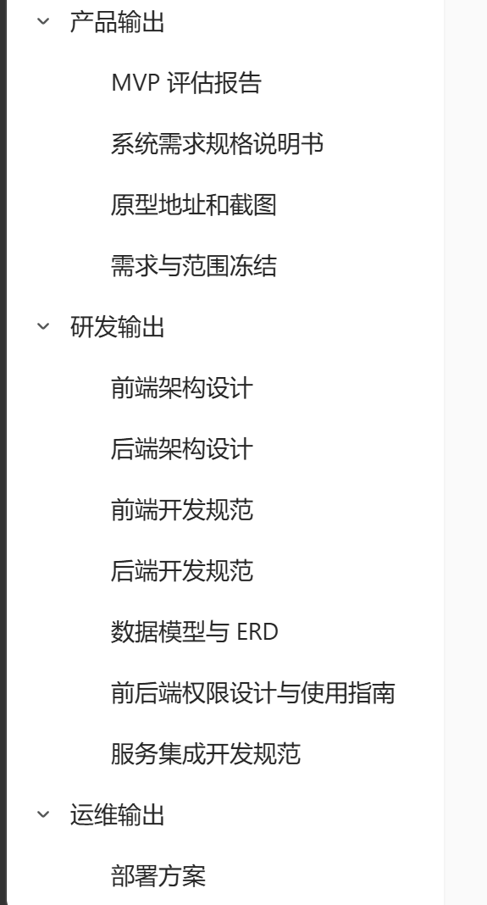

# Evidence

`evidence/` 保存原始需求、截图、原型、访谈记录和外部参考。证据帮助回答“结论从哪里来”，但未经整理、确认和晋升时，不直接构成产品需求或系统 spec。

## 规则

* 保留来源、接收日期和必要的上下文；
* 二进制材料使用可读的英文文件名；
* 重要截图旁应有 Markdown 文档解释其意义，或由上级索引提供说明；
* 外部材料应记录原始链接和访问日期；
* 含敏感信息的材料不进入 `docs/`，应放入根目录 `private/` 或安全的外部存储；
* 证据被引用时，从讨论、决策或 spec 通过相对链接指向这里。

## 当前证据

### 文档交付物参考截图

文件：[`references/2026-08-11-document-deliverables.png`](references/2026-08-11-document-deliverables.png)

来源：用户在 2026-08-11 提供的参考截图。

截图列出了 MVP 评估、系统需求规格、原型、范围冻结、前后端架构与开发规范、数据模型、权限、服务集成和部署方案等交付物。它用于验证文档体系能否容纳这些材料，不代表这些文档现在已经存在或已经成为需求。

